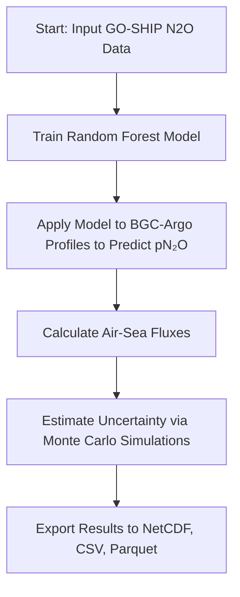

# ml-argo-n2o

[](https://www.researchsquare.com/article/rs-6378208/v1)

> VERSION FOR REVIEWING PURPOSES ONLY - OFFICIAL VERSION TO BE PUBLISHED ON ZENODO

## Contents

- [Overview](#overview)
- [Repository Contents](#repository-contents)
- [System Requirements](#system-requirements)
- [Installation Guide](#installation-guide)
- [Demo](#demo)
- [Instructions for Use](#instructions-for-use)
- [Results](#results)
- [License](#license)
- [Citation](#citation)
- [Contact](#contact)

## Overview

This repository contains code to train machine learning models for predicting nitrous oxide (N2O) from oceanographic variables and apply those models to Biogeochemical Argo (BGC-Argo) float data. The trained models are then used to estimate air-sea N2O fluxes and their uncertainties.

### Workflow



## Repository Contents

### Model Training

- `trainrf_v2.py`: Trains four Random Forest models using temperature, salinity, dissolved oxygen, and nitrate as predictors of N2O.

### Application to Float Data

- `applyrf_v2.py`: Applies trained Random Forest models to BGC-Argo float profiles to generate predicted partial pressure of N2O (`pN2O`).

- `plot_predictedn2o.py`: Generates:
  - Maps of predicted `pN2O` values
  - Maps of associated uncertainties
  - Histograms of prediction uncertainty distributions

### Air-Sea Flux Calculation

- `flux_uncertainties.py`: Calculates air-sea N2O fluxes using predicted `pN2O` and associated uncertainties.

- `assign_fluxes_metadata.py`: Converts output to:
  - NetCDF format (`.nc`)
  - Parquet format (`.parquet`)
  - CSV format (`.csv`) with standardized metadata

## System Requirements

### Hardware
- **Minimum**: 2 cores, 4 GB RAM
- **Recommended**: 4-16 cores, 16+ GB RAM
- **Tested configurations**:
  - HPC node (16 cores, 10 GB per core)
  - MacBook Pro with Apple M2 Pro (10-core CPU, 32 GB RAM)

### Software
- OS: Linux, macOS, or Windows (tested on CentOS Linux 7 (Core) (cluster environment) and macOS Sonoma 14.6)
- Python: 3.8 or higher

### Python Dependencies
- `cartopy`
- `gsw`
- `joblib`
- `jupyter`
- `jupyterlab`
- `matplotlib`
- `numpy`
- `pandas`
- `pyarrow`
- `python-dotenv`
- `scikit-learn`
- `seaborn`
- `xarray`

## Installation Guide

### Clone the Repository

```bash
git clone https://github.com/ckelly314/ml-argo-n2o.git
cd ml-argo-n2o
```

### Environment Setup (Recommended)

We recommend setting up a Python virtual environment to avoid dependency conflicts:
```bash
conda env create -f environment.yml
conda activate ml-argo-n2o
```

### Install Time

Typical install time on a standard desktop computer: **~2–3 minutes**.

## Demo

To run a full pipeline demo using the October 2024 snapshot of BGC-Argo float profiles in the Southern Ocean:

1. Train models:
   ```bash
   python trainrf_v2.py
   ```
2. Apply models to float data:
   ```bash
   python applyrf_v2.py
   ```
3. Plot predictions:
   ```bash
   python plot_predictedn2o.py
   ```
4. Calculate air-sea fluxes:
   ```bash
   python flux_uncertainties.py
   ```
5. Export to standard formats:
   ```bash
   python assign_fluxes_metadata.py
   ```

Expected output:
- Predicted N2O profiles and maps
- Uncertainty plots
- Flux estimates in NetCDF, CSV, and Parquet formats

Expected runtime on a 4-core desktop: ~5 minutes total.

## Instructions for Use

To retrain the Random Forest model on a different N2O dataset:
1. Format training data as per `datasets/goshipdataset.csv`
2. Use `trainrf_v2.py` to train models

To run the pipeline on your own BCG-Argo dataset with paired sea level pressures, wind speeds, and sea ice cover:

1. Format input data as per `datasets/argodataset.csv`
2. Use `applyrf_v2.py` to generate predictions
3. Use `flux_uncertainties.py` to compute air-sea fluxes

## Results

This pipeline produces the following figures from the associated paper:

- **Extended Data Fig. 2**: Random forest model performance (R², RMSE).
- **Extended Data Fig. 4**: Predicted pN2O.   
- **Figure 2**: Southern Ocean N2O flux estimates with uncertainties.

### Reproduce All Manuscript Results

To reproduce all of the figures and key results in the associated paper, refer to the Jupyter notebook `reproduce_results.ipynb`.

## License
This project is licensed under [MIT License](LICENSE).

## Citation
If you use this code in your research, please cite the paper:

> C.L. Kelly, B.X. Chang, A. Emmanuelli, E. Park, A. Macdonald, & D.P. Nicholson. Low-pressure storms drive nitrous oxide emissions in the Southern Ocean, 30 April 2025, PREPRINT (Version 1) available at Research Square [https://doi.org/10.21203/rs.3.rs-6378208/v1]

## Contact
For questions or collaborations, please contact Colette Kelly (https://github.com/ckelly314).
