# ml-argo-n2o

[](https://www.researchsquare.com/article/rs-6378208/v1)

**Note that the datasets are archived separately at https://doi.org/10.5281/zenodo.17904982** \\
To run the code in this repository, download the contents of the data repository above into the "datasets" directory.

## Contents 📚

- [Overview](#overview)
- [Repository Contents](#repository-contents)
- [System Requirements](#system-requirements)
- [Installation Guide](#installation-guide)
- [Demo](#demo)
- [Instructions for Use](#instructions-for-use)
- [Results](#results)
- [Acknowledgements](#acknowledgements)
- [License](#license)
- [Citation](#citation)
- [Contact](#contact)

## Overview 🌍

This repository contains code to train machine learning models for predicting nitrous oxide ($$N_2O$$) from oceanographic variables and applying those models to Biogeochemical Argo (BGC-Argo) float data. The trained models are then used to estimate air-sea $$N_2O$$ fluxes and their uncertainties.

### Workflow 🔁

```mermaid
flowchart TD
    A["GO-SHIP N2O Data"] --> B["🏋️‍♀️ Train Random Forest Models"]
    B --> C["🤖 Apply Model to BGC-Argo Profiles to Predict pN₂O"]
    C --> D["🌊 Calculate Air-Sea Fluxes and estimate uncertainty"]
    n1["BGC-Argo Data"] --> C
    D --> F["📈 Plot figures"]
    style A color:#000000,fill:#FFFFFF,stroke-width:4px,stroke-dasharray: 0,stroke:#000000
    style B color:#000000,fill:#FFFFFF,stroke-width:4px,stroke-dasharray: 0,stroke:#000000
    style C color:#000000,fill:#FFFFFF,stroke-width:4px,stroke-dasharray: 0,stroke:#000000
    style D color:#000000,fill:#FFFFFF,stroke-width:4px,stroke-dasharray: 0,stroke:#000000
    style F color:#000000,fill:#FFFFFF,stroke-width:4px,stroke-dasharray: 0,stroke:#000000
    style n1 color:#000000,fill:#FFFFFF,stroke-width:4px,stroke-dasharray: 0,stroke:#000000
```



## Repository Contents 📂

### Model Training 🏋️‍♀️

- `trainrf_v2.py`: Trains four Random Forest models using temperature, salinity, dissolved oxygen, and nitrate as predictors of $$N_2O$$. Save out model performance metrics to include MAE in uncertainty propagation.

### Application to Float Data 🤖

- `applyrf_v2.py`: Applies trained Random Forest models to BGC-Argo float profiles to generate predicted partial pressure of $$N_2O$$ ($$pN_2O$$).

- `plot_predictedn2o.py`: Plot maps of predicted n2o and uncertainties; plot histogram of uncertainties.

### Air-Sea Flux Calculation 🌊

- `flux_uncertainties_v3.py`: Calculates air-sea $$N_2O$$ fluxes using predicted $$pN_2O$$ and associated uncertainties.

- `flux_uncertainties.sh`: Optional example batch script to submit `flux_uncertainties_v3.py` as a batch job to a computer cluster.

### Plot figures 📊
- `main_text_figures.ipynb`

## System Requirements 💻

### Hardware
- **Minimum**: 2 cores, 4 GB RAM 🐢
- **Recommended**: 4-16 cores, 16+ GB RAM 🚀
- **Tested configurations**:
  - HPC node (16 cores, 10 GB per core)
  - MacBook Pro with Apple M2 Pro (10-core CPU, 32 GB RAM)

### Software
- OS: Linux, macOS, or Windows (tested on CentOS Linux 7 (Core) (cluster environment) and macOS Sonoma 14.6)
- Python: 3.8 or higher

### Python Dependencies 📦
- `cartopy`
- `gsw`
- `joblib`
- `jupyter`
- `jupyterlab`
- `matplotlib`
- `numpy`
- `pandas`
- `pyarrow`
- `python-dotenv`
- `scikit-learn`
- `seaborn`
- `xarray`

## Installation Guide 🛠️

### Clone the Repository

```bash
git clone https://github.com/ckelly314/ml-argo-n2o.git
cd ml-argo-$$N_2O$$
```

### Environment Setup (Recommended)

We recommend setting up a Python virtual environment to avoid dependency conflicts:
```bash
conda env create -f environment.yml
conda activate ml-argo-n2o
```

### Install Time ⏱️

Typical install time on a standard desktop computer: **~2–3 minutes**.

## Demo 🎬

To run a full pipeline demo using the October 2024 snapshot of BGC-Argo float profiles in the Southern Ocean:

1. Train models:
   ```bash
   python trainrf_v2.py
   ```
2. Apply models to float data:
   ```bash
   python applyrf_v2.py
   ```
3. Plot predictions:
   ```bash
   python plot_predictedn2o.py
   ```
4. Calculate air-sea fluxes interactively 🐢:
   ```bash
   python flux_uncertainties_v3.py
   ```
   OR Calculate air-sea fluxes with batch script 🚀:
   ```bash
   sbatch flux_uncertainties.sh
   ```
5. Compile and save out data for main text figures:
Run the notebook **save_figure_data.ipynb**

5. Plot main text figures from paper:
Run the notebook **main_text_figures.ipynb**

Expected output:
- Predicted $$N_2O$$ values: **n2opredictions.parquet**
- Trained models:
   - **model1_rf_full.joblib**
   - **model2_rf_full.joblib**
   - **model3_rf_full.joblib**
   - **model4_rf_full.joblib**
- Monte carlo arrays: series of .npy files in datasets/
- Air-sea fluxes: series of .npy files in datasets/fluxtests/
- Compiled data for main text figures:
   - **fig1.csv**
   - **fig2a.csv**
   - **fig2b.csv**
   - **fig3.csv**
   - **fig4.csv**
   - **fig5.csv**
   - **fig5column2.csv**
- Vector files of main text figures:
   - **figure1.pdf**
   - **figure2.pdf**
   - **figure3.pdf**
   - **figure4.pdf**
   - **figure5.pdf**

Expected runtime on a 4-core desktop: ~25 minutes total (slowest step is running flux_uncertainties.py).

## Instructions for Use 🧑‍🔬

To retrain the Random Forest model on a different $$N_2O$$ dataset:
1. Format training data as per `datasets/goshipdataset.csv`
2. Use `trainrf_v2.py` to train models

To run the pipeline on your own BCG-Argo dataset with paired sea level pressures, wind speeds, and sea ice cover:

1. Format input data as per `datasets/argodataset.csv`
2. Use `applyrf_v2.py` to generate predictions
3. Use `flux_uncertainties.py` to compute air-sea fluxes

## Figures 📊

This pipeline produces the following figures from the associated paper:

- **Figure S15**: Random forest model performance (R², RMSE).
- **Figure S18**: Predicted $$pN_2O$$ and uncertainty.   
- **Figures 1-5**: Main text figures.

## Acknowledgements 🙌
Training data were collected and made publicly available by the U.S. Global Ship-based Hydrographic Investigations Program (U.S. GO-SHIP; https://usgoship.ucsd.edu/) and the programs that contribute to it. BGC-Argo data were assembled or collected and made available by the Global Ocean Biogeochemistry Array (GO-BGC) Project funded by the National Science Foundation (NSF grant #OCE-1946578). NCEP-NCAR Reanalysis 1 data was provided by the NOAA PSL, Boulder, Colorado, USA, from their website at https://psl.noaa.gov. 

## License 📄
This project is licensed under [MIT License](LICENSE).

## Citation ✍️
If you use this code in your research, please cite the paper:

> C.L. Kelly, B.X. Chang, A. Emmanuelli, E. Park, A. Macdonald, & D.P. Nicholson. Low-pressure storms drive nitrous oxide emissions in the Southern Ocean, 30 April 2025, PREPRINT (Version 1) available at Research Square [https://doi.org/10.21203/rs.3.rs-6378208/v1].

## Contact 📬
For questions or collaborations, please contact Colette Kelly (https://github.com/ckelly314).
